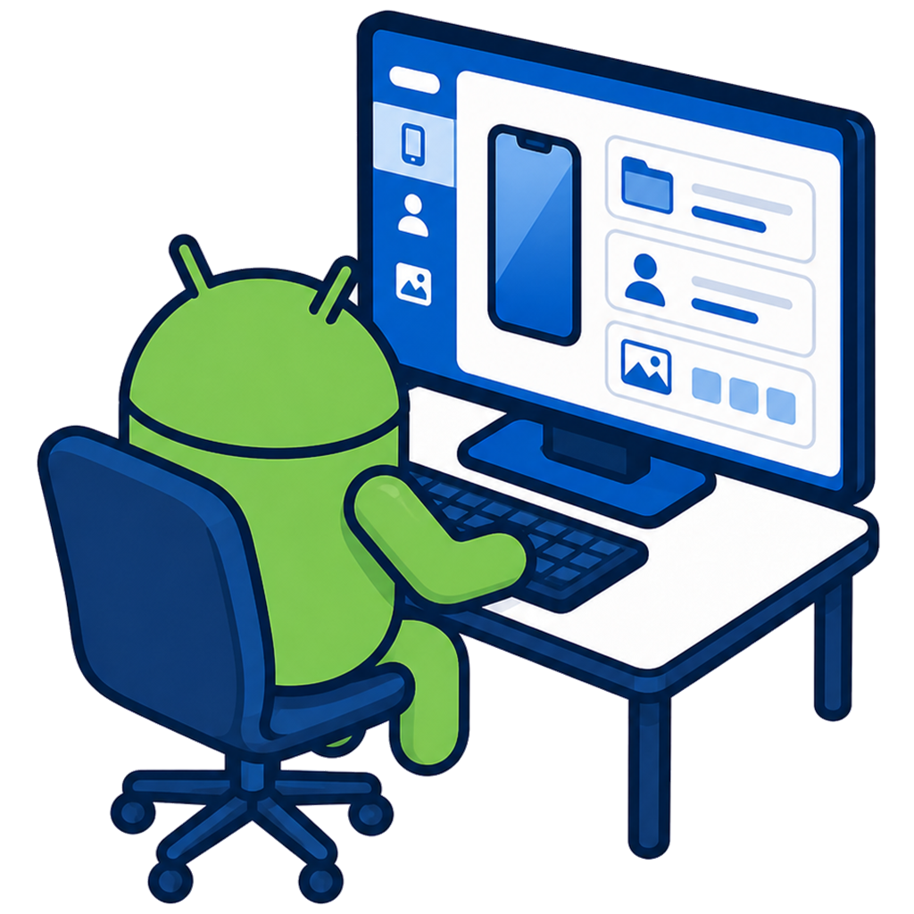

# AndroLink

  

**Retrouvez votre téléphone sur votre ordinateur, avec des habitudes que vous connaissez déjà.**

AndroLink vous permet de parcourir les fichiers de votre téléphone, retrouver vos photos, gérer vos contacts et vos SMS, créer des sauvegardes et préparer un changement de téléphone, depuis une seule application.

C’est un projet personnel et indépendant, édité par **Alfly-Alyx**, conçu pour être accessible sans être spécialiste en informatique.

[**Télécharger la dernière version**](https://github.com/Alfly-Alyx/AndroLink-public/releases/latest) · [Toutes les versions](https://github.com/Alfly-Alyx/AndroLink-public/releases) · [English](#english)

## Un explorateur familier pour votre téléphone

L’explorateur intégré reprend les repères de l’Explorateur Windows : dossiers, barre d’adresse, retour au dossier précédent, affichage en liste ou en icônes, menus au clic droit, sélection multiple et raccourcis clavier.

Vous parcourez les dossiers accessibles **du téléphone connecté**. Vous pouvez y ranger vos fichiers et choisir ceux que vous souhaitez copier vers l’ordinateur. Pour envoyer des fichiers dans l’autre sens, vous les sélectionnez sur le PC ou utilisez le glisser-déposer.

## Vos données restent sous votre contrôle

**Votre téléphone communique directement avec votre PC**, par câble USB ou par le réseau local que vous avez autorisé. Vos fichiers, photos, contacts et SMS sont échangés entre vos deux appareils, sans passer par un serveur de transfert AndroLink.

**Aucun compte AndroLink à créer, aucun cloud AndroLink à utiliser.** Une fois installé avec les composants nécessaires, AndroLink permet de gérer le téléphone sans connexion Internet. Internet sert aux mises à jour, aux informations complémentaires et aux services d’aide, pas au transfert de votre photothèque ou de votre carnet d’adresses.

**Vous choisissez ce que vous sauvegardez et ce que vous copiez.** Vos sauvegardes personnelles sont chiffrées sur le PC. Les fichiers que vous copiez ou exportez restent des fichiers ordinaires dans le dossier choisi. L’application conserve aussi ses réglages et ses données de fonctionnement ; certains aperçus et transferts utilisent des copies temporaires qui ne sont pas chiffrées comme les sauvegardes.

**La recherche photo travaille localement.** Vos images sont analysées sur le PC, sans les envoyer à une intelligence artificielle en ligne. Le catalogue qui permet de les retrouver est chiffré et conservé sur le téléphone lorsque son compagnon le permet, ou sur le PC dans les autres cas.

**Vous décidez des accès accordés.** Le compagnon Android vous guide vers les réglages du téléphone pour retirer ses autorisations. Vous pouvez également retirer l’autorisation de connexion du PC depuis le téléphone et désactiver la recherche photo dans AndroLink. Le contrôle de l’écran avec AndroLink Remote s’effectue depuis le PC connecté.

## Ce que vous pouvez faire avec AndroLink

Les fonctions disponibles dépendent du téléphone, de son système et des autorisations accordées. AndroLink indique ce qui est accessible sur l’appareil connecté.

### Fichiers, photos et vidéos

- Parcourir les dossiers, trier leur contenu et rechercher des fichiers par nom, y compris dans les sous-dossiers.
- Créer des dossiers, renommer, copier, déplacer ou supprimer les éléments sélectionnés.
- Copier des fichiers entre le PC et le téléphone, avec glisser-déposer, raccourcis clavier et sélection multiple.
- Suivre les copies, les mettre en file d’attente, les annuler et choisir quoi faire lorsqu’un fichier existe déjà.
- Voir les miniatures et les aperçus des photos ; classer les photos et vidéos par nom, date ou type.
- Retrouver des photos par leur contenu avec des mots-clés courants en **français et en anglais**. L’allemand et l’espagnol sont en préparation pour la version 0.8.17.
- Identifier l’espace occupé et nettoyer les caches accessibles, les fichiers temporaires, les corbeilles et les anciens fichiers d’installation, selon ce que le téléphone autorise.

### Contacts

- Consulter, créer, modifier et supprimer des contacts, avec plusieurs numéros, adresses, e-mails, photos et autres informations.
- Modifier plusieurs fiches à la fois et repérer puis fusionner les doublons après confirmation.
- Importer ou exporter des contacts au format vCard.
- Importer un tableau Excel ou CSV, choisir les colonnes et vérifier les fiches avant leur ajout.
- Exporter un tableau Excel personnalisé, avec les colonnes, photos et options de présentation choisies.
- Sauvegarder et restaurer le carnet d’adresses.

### SMS et notifications

- Lire les SMS en conversations ou en liste, rechercher un message et rédiger un SMS depuis le PC.
- Exporter les messages en texte, sauvegarder une sélection ou des conversations entières, puis les restaurer.
- Supprimer des SMS après confirmation et avec les autorisations demandées par Android.
- Consulter les notifications compatibles et utiliser les actions proposées par le téléphone, y compris répondre lorsque cette action est disponible.

Les MMS et les conversations RCS ne sont pas pris en charge. L’envoi d’un SMS utilise la carte SIM du téléphone et reste soumis à votre forfait mobile.

### Applications

- Retrouver les applications installées, leur version, leur origine et leur taille lorsqu’elles sont disponibles.
- Installer des applications, les activer, les désactiver ou les désinstaller selon les possibilités du système.
- Sauvegarder les fichiers d’installation Android, puis réinstaller les applications choisies.
- Sur les téléphones Linux compatibles, consulter les applications et utiliser les méthodes d’installation proposées pour le système détecté.

La sauvegarde d’une application Android ne comprend pas ses données privées : une progression de jeu ou une connexion à un compte ne sont pas automatiquement restaurées.

### Sauvegardes et changement de téléphone

- Créer et retrouver des sauvegardes locales de contacts, SMS, applications et données accessibles.
- Vérifier leur intégrité, consulter leur contenu et choisir les éléments à restaurer.
- Préparer un transfert de téléphone avec les fichiers personnels, photos, vidéos et autres catégories compatibles.
- Estimer le volume et la durée du transfert, puis consulter ce qui a réussi ou demande une intervention.
- Être guidé pour reconnecter les comptes sur le nouveau téléphone, sans récupérer leurs mots de passe.

Le transfert dépend des possibilités des deux téléphones. AndroLink ne promet pas une copie intégrale de toutes les données vers n’importe quel appareil.

### Écran, sons et navigation

- Afficher et contrôler l’écran Android à la souris et au clavier avec **AndroLink Remote**, y compris les appuis longs.
- Copier ou coller volontairement entre le téléphone et le PC, sans synchronisation automatique du presse-papiers.
- Régler les volumes du multimédia, des sonneries, notifications et alarmes lorsque le téléphone le permet.
- Choisir des onglets Chrome ouverts sur Android et les ouvrir dans le navigateur du PC. Cette fonction est expérimentale ; les onglets privés ne sont pas lus.

AndroLink Remote ne transmet pas le son du téléphone.

### Informations, réglages et accompagnement

- Consulter les informations réellement communiquées par le téléphone : modèle, système, version, stockage, mémoire et processeur.
- Voir les informations disponibles sur la batterie et les indicateurs de sécurité du système.
- Être guidé pour la connexion USB ou Wi-Fi et résoudre les difficultés de reconnaissance du téléphone.
- Choisir les comportements de connexion et les réglages compatibles proposés par le téléphone.
- Consulter les comptes visibles et ouvrir les réglages du téléphone pour les gérer, sans lire les mots de passe.
- Accéder aux réglages officiels de contrôle parental, sans contourner les protections du téléphone.
- Découvrir les systèmes mobiles alternatifs et rechercher les possibilités officiellement proposées pour son appareil.
- Accéder, sur les téléphones Linux compatibles, aux outils avancés de terminal et de diagnostic.
- Choisir l’apparence disponible, la fréquence de recherche des mises à jour et retrouver une version précédente compatible.
- Envoyer une suggestion, demander de l’aide ou signaler un problème depuis le formulaire proposé dans l’application.

## Télécharger et commencer

Les versions proposées ici sont destinées à **Windows 10 et Windows 11, en 64 bits**. Chaque publication fournit un installateur qui choisit l’interface adaptée à votre Windows, ainsi que deux archives portables distinctes.

Les compagnons et les composants prévus pour les téléphones compatibles sont inclus dans la distribution. Vous n’avez pas à les rechercher séparément.

**Android 5.0 ou plus récent** est pris en charge. Des fonctions sont également proposées pour les téléphones Linux mobile compatibles, dont le Librem 5, ainsi que pour les Lumia/Windows Phone et le Nokia N9. Leur prise en charge reste partielle ou expérimentale : tous n’offrent pas les mêmes fonctions qu’Android. Les éditions PC pour macOS et Linux ne sont pas encore distribuées ici. Les iPhone et iPad ne sont pas pris en charge actuellement.

1. Téléchargez l’installateur ou l’archive portable correspondant à votre Windows.
2. Installez l’application, ou décompressez entièrement l’archive portable avant de lancer AndroLink.
3. Branchez votre téléphone avec un câble permettant le transfert de données, déverrouillez-le et suivez l’aide affichée. Sur Android, la première connexion demande d’activer le débogage USB et d’autoriser votre PC sur le téléphone.

Les exécutables ne disposent pas actuellement d’un certificat commercial de signature. Windows peut donc afficher un avertissement SmartScreen : utilisez les fichiers disponibles sur [la page officielle des versions](https://github.com/Alfly-Alyx/AndroLink-public/releases).

Ce dépôt public rassemble la présentation du logiciel et ses téléchargements. Les mentions des composants tiers sont fournies avec l’application.

---

## English

### Your phone, managed from your PC

AndroLink brings your phone’s everyday tools together on your Windows PC: files, photos, contacts, text messages, applications, backups and more. It is an independent personal project published by **Alfly-Alyx**.

Its file manager uses familiar Windows File Explorer controls to browse the storage accessible on your phone. An address bar, navigation history, search, selection, context menus and drag-and-drop help you find and organise your files using habits you already know.

Available features depend on the phone, its operating system and the permissions you grant. AndroLink uses the capabilities it actually detects.

### Your data stays under your control

**Your phone communicates directly with your PC**, over USB or an authorised local network. Files, photos, contacts and SMS messages travel between your two devices without an AndroLink transfer server.

**No AndroLink account to create and no AndroLink cloud to use.** Once the necessary components are installed, you can manage your connected phone without an Internet connection. Internet access serves updates, additional information and support services, rather than transferring your photo library or address book.

**You choose what to back up and what to copy.** Personal-data backups are encrypted on your PC. Files you copy or export remain ordinary files in your chosen folder. AndroLink also keeps settings and data needed to run; some previews and transfers use temporary copies that do not have the backups’ encryption.

**Photo search runs locally.** Images are analysed on your PC without sending them to an online AI service. The search catalogue is encrypted and stored on the phone when its companion supports it, or on the PC otherwise.

**You control access.** The Android companion guides you to your phone’s settings to remove its permissions. You can also remove the PC’s connection authorisation on the phone and disable photo search in AndroLink. AndroLink Remote controls the screen from the connected PC.

### What you can do

- **Browse and organise files:** search by name, including subfolders; create folders; copy, move, rename and delete items; use drag-and-drop and familiar shortcuts; inspect properties; queue transfers, follow progress, handle existing files and cancel operations.
- **Find photos and videos:** browse thumbnails and photo previews, sort by name, date or type, and search photo content with common French and English keywords. German and Spanish are being prepared for version 0.8.17.
- **Manage storage:** inspect available space and clean accessible caches, temporary files, trash and old installation files, according to the phone’s permissions.
- **Manage contacts:** create and edit contact details and photos, change several contacts at once, detect and merge duplicates after confirmation, import and export vCard, preview Excel and CSV imports, customise Excel exports, and back up or restore contacts.
- **Handle SMS and notifications:** read conversations or chronological lists, search and send standard SMS messages, export messages as text, back up and restore selected messages or conversations, and delete messages after confirmation. View supported notifications and use the actions offered by the phone. MMS and RCS are not supported; sending SMS uses the phone’s SIM and remains subject to your mobile plan.
- **Manage applications:** view installed applications, their versions, origins and available sizes; install, enable, disable or uninstall applications where permitted; back up Android installation files and reinstall selected applications. These backups do not include an application’s private data, such as game progress or signed-in accounts. Compatible Linux phones offer application management appropriate to their system.
- **Back up, restore and change phones:** create encrypted personal-data backups, check their integrity, preview their contents and choose what to restore. Prepare transfers of supported contacts, SMS, files, photos, videos and applications, estimate their size and duration, and see what succeeded. Account reconnection is guided without retrieving passwords. Coverage depends on both phones; this is not a complete backup of every application or every device.
- **Use the connected phone from your PC:** view and control Android with the mouse and keyboard, including long presses; copy and paste deliberately without automatic clipboard synchronisation; adjust supported sound volumes. AndroLink Remote does not stream audio. Experimental Chrome tab continuation opens selected Android tabs in your PC browser and excludes private browsing.
- **Understand and configure your phone:** see detected device, system, storage, memory, processor, battery and security information. Get USB and Wi-Fi help, adjust supported connection settings, view available accounts without reading passwords, and open official parental-control settings. Discover alternative mobile operating systems and official options for your phone. Advanced users can access supported Linux terminal and diagnostic tools.
- **Adjust AndroLink and get help:** choose available appearance options and update-check frequency, access compatible previous versions, and submit a suggestion, help request or problem report through the application’s feedback form.

### Download and compatibility

[**Download the latest stable release**](https://github.com/Alfly-Alyx/AndroLink-public/releases/latest)

Each Windows release includes:

- one **Windows 10/11 x64 installer** that selects the appropriate interface;
- one **Windows 10 portable archive**;
- one **Windows 11 portable archive**.

Companions and the components supplied for supported phones are bundled with AndroLink. You do not need to find them separately.

Android support starts at **Android 5.0**. Compatible mobile Linux phones, including Librem 5, as well as Lumia/Windows Phone and Nokia N9 devices also have partial or experimental support. They do not all offer the same features as Android. Desktop editions for macOS and Linux are not currently distributed here. iPhone and iPad are not currently supported.

Download the installer or fully extract the portable archive before starting AndroLink. Connect and unlock your phone, then follow the connection guide. Android’s first connection requires enabling USB debugging and authorising your PC on the phone.

Windows builds currently have no commercial code-signing certificate, so SmartScreen may display a warning. Use the downloads from [this official release page](https://github.com/Alfly-Alyx/AndroLink-public/releases).

This public repository provides the product presentation and downloads. Third-party notices are included with the application.

---

Une idée ou un souci ? Utilisez le formulaire proposé dans AndroLink, ou ouvrez un [ticket public](https://github.com/Alfly-Alyx/AndroLink-public/issues). N’y joignez pas de données personnelles.

Have a suggestion or a problem? Use AndroLink’s feedback form or open a [public issue](https://github.com/Alfly-Alyx/AndroLink-public/issues). Do not include personal data in public reports.

Android est une marque de Google LLC. Le robot Android est reproduit ou adapté à partir d’un travail créé et partagé par Google, selon la licence Creative Commons Attribution 3.0. AndroLink est un projet indépendant, sans affiliation ni approbation de Google LLC.

Android is a trademark of Google LLC. The Android robot is reproduced or adapted from work created and shared by Google under the Creative Commons Attribution 3.0 License. AndroLink is an independent project and is not affiliated with or endorsed by Google LLC.
